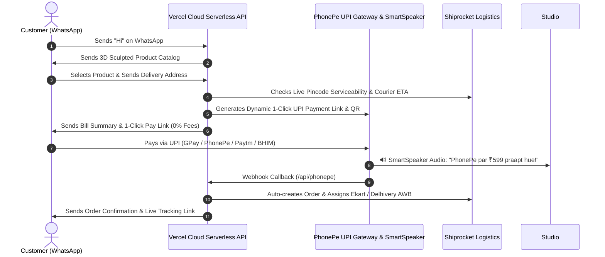

# Viyona Commerce Backend 🚀

> **24/7 Standalone Cloud Microservice for Viyona Designs**  
> Conversational WhatsApp Business Commerce $\rightarrow$ Instant PhonePe UPI Payments $\rightarrow$ Automated Shiprocket Courier Fulfillment.

---

## 🌟 Architecture Overview



---

## 🛠️ API Endpoints

| Endpoint | Method | Purpose |
| :--- | :---: | :--- |
| **`/api/health`** | `GET` | Healthcheck and service status endpoint. |
| **`/api/whatsapp`** | `GET` | Meta WhatsApp Cloud API Webhook handshake verification. |
| **`/api/whatsapp`** | `POST` | Incoming customer messages, catalog selection, and address processing. |
| **`/api/phonepe`** | `POST` | PhonePe payment webhook receiver & automatic Shiprocket order dispatch trigger. |
| **`/api/track`** | `GET` | Real-time live customer tracking lookup (`?awb=...` or `?order_id=...`). |

---

## 🚀 Quick Deployment to Vercel (1-Click)

1. Push this repository to your GitHub account:
   ```bash
   git remote add origin https://github.com/ravisharmavashishtha/viyona-commerce-backend.git
   git branch -M master
   git push -u origin master
   ```
2. Go to **[vercel.com](https://vercel.com)** $\rightarrow$ **Add New Project** $\rightarrow$ Import **`viyona-commerce-backend`**.
3. In **Settings $\rightarrow$ Environment Variables**, configure:
   * `PHONEPE_MERCHANT_VPA`: `viyonadesigns@ybl`
   * `SHIPROCKET_EMAIL`: `support@viyonadesigns.com`
   * `SHIPROCKET_PASSWORD`: `Qyx43G%n6PYw6HFi0xsr^hl051bZN9Bl`
   * `WHATSAPP_VERIFY_TOKEN`: `viyona_secret_token_2026`
   * `META_ACCESS_TOKEN`: *(From Meta Developer Portal)*
   * `WHATSAPP_PHONE_NUMBER_ID`: *(From Meta Developer Portal)*
4. Click **Deploy**!

---

## 🧪 Local Testing

Run the automated simulation test suite:
```bash
npm test
```
